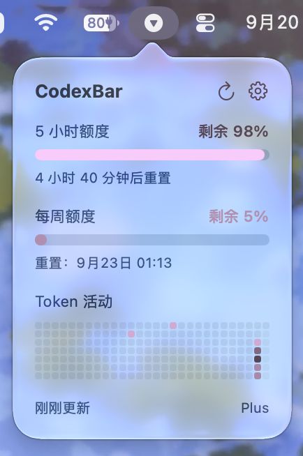

# CodexBar

[](https://github.com/kexinOvO/CodexBar/actions/workflows/ci.yml)

A native macOS menu bar app for monitoring **OpenAI Codex CLI rate limits and token activity**.

CodexBar works exclusively with the Codex CLI already installed and authenticated on your Mac. It launches `codex app-server` and reads account, rate-limit, and token-usage data through its structured stdin/stdout protocol.

The current version has **completely removed PTY / TUI automation**. CodexBar no longer simulates paste, Enter, or slash commands, and it does not call OpenAI HTTP APIs directly.



## Current Status

- Native SwiftUI + AppKit menu bar application
- No Electron, Tauri, or third-party runtime dependencies
- Current project version: `2.0`
- Xcode project and CI currently use **Xcode 27**
- Current `MACOSX_DEPLOYMENT_TARGET = 27.0`
- Data layer migrated to `codex app-server`
- Unit tests run automatically on pushes to `main` and on pull requests
- `v*` tags automatically build a DMG and create a GitHub Release

> The project's actual deployment target is currently macOS 27.0. Supporting earlier macOS versions requires lowering the deployment target and reviewing the availability of the SwiftUI / AppKit APIs used by the app. Changing the README alone is not sufficient.

## Features

### Rate Limits

- Shows remaining percentages for the 5-hour and Weekly limits
- Progress bars with reset times
- `Simple` and `Full` display modes
- Warning styles for low remaining quota
- Optional notifications for:
  - Weekly `< 10%`
  - Weekly `< 5%`
  - 5h `< 10%`

### Token Activity

- GitHub-style activity heatmap
- Uses real daily token counts from `dailyUsageBuckets`
- Adjustable heatmap range from 6 to 10 months
- Five activity levels: no activity + four intensity levels
- Hover details with date and exact token count
- Lifetime / Peak / Streak / Longest Task overview
- Overview statistics can be hidden independently

### Menu Bar & Appearance

Menu bar display modes:

- Icon only
- Weekly remaining %
- 5h + Weekly %

Appearance options:

- System / Light / Dark appearance
- Default / Custom accent color
- Custom mode uses luminance steps to distinguish quota states and heatmap intensity
- Adjustable popover width: 200–480 pt
- Left-click opens the popover
- Right-click opens a native context menu
- Native menu includes Refresh Now, Settings, and Quit

### Automatic Refresh & Cache

- Status refreshes every 5 minutes by default
- Activity refreshes every 30 minutes by default
- Refresh intervals are configurable in Settings
- Cached data is loaded immediately on launch while fresh data is fetched in the background
- Opening the popover checks data freshness and refreshes when necessary
- Failed refreshes preserve the last valid cache instead of clearing the UI
- Concurrent refreshes of the same type are guarded against

### Settings

The Settings window uses native `Window` + `NavigationSplitView` + `Form` components and is divided into three sections:

| Section | Options |
| --- | --- |
| General | Launch at login, Status / Activity refresh intervals, low-quota notifications |
| Appearance | Appearance, accent color, menu bar mode, quota mode, popover width, heatmap range, statistics visibility |
| CLI | Codex path, auto-detection, version, last query, connection status |

### Localization

CodexBar currently includes:

- English
- Simplified Chinese
- Traditional Chinese
- Japanese
- Korean
- German

Localization resources are stored in `CodexBar/Localizable.xcstrings`.

## Data Architecture

CodexBar **does not create a PTY or open the Codex TUI**.

```text
CodexBar
  └── codex app-server
        └── stdin / stdout
              ├── initialize
              ├── initialized
              ├── account/read
              ├── account/rateLimits/read
              └── account/usage/read
```

### Handshake

After launching `codex app-server`:

1. CodexBar sends `initialize`
2. It waits for the initialization response
3. CodexBar sends `initialized`
4. Account, rate-limit, and usage requests can then begin

The Codex App Server wire protocol uses request / response semantics, but current upstream messages **do not include** the standard JSON-RPC field:

```json
{"jsonrpc":"2.0"}
```

CodexBar includes protocol tests specifically for this behavior to prevent accidental introduction of that field during future refactors.

### Account

`account/read` is used to:

- Determine whether Codex is signed in
- Read the ChatGPT account email
- Read the account plan type

If authentication is required but no account is available, CodexBar shows a signed-out state and prompts the user to run:

```bash
codex login
```

### Rate Limits

`account/rateLimits/read` returns structured rate-limit windows.

CodexBar does **not** depend on the ordering of `primary` / `secondary`. Instead, windows are matched using `windowDurationMins`:

- Approximately `300` minutes → 5h
- Approximately `10,080` minutes → Weekly

Remaining quota is calculated as:

```text
remaining = 100 - usedPercent
```

Reset times come directly from the structured `resetsAt` timestamp.

### Token Usage

`account/usage/read` returns account-level token activity, including:

- Lifetime tokens
- Peak daily tokens
- Current streak
- Longest running task
- `dailyUsageBuckets`

CodexBar uses exact daily token counts to build the heatmap and calculates intensity levels from 0–4 relative to the peak day.

## Why TUI Automation Was Removed

The previous architecture required:

```text
PTY
 → Codex TUI
 → simulate paste
 → simulate Enter
 → wait for UI state
 → parse ANSI / terminal text
```

That approach was vulnerable to composer state, terminal redraws, swallowed keystrokes, slash-command autocomplete, and other terminal UI behavior.

The current architecture has no chat composer and never types slash commands automatically, so issues such as these are no longer part of the runtime path:

```text
/status/status
/usage daily/usage daily
/status/quit
```

The old `CodexSession`, `StatusParser`, `UsageParser`, `ANSIStyleScanner`, `ANSITextCleaner`, and their related tests have been removed from the repository.

## Codex CLI Detection

CodexBar validates whether a candidate executable can actually run `codex --version` instead of merely checking whether a file exists.

Detection order:

1. Path explicitly configured in Settings
2. `/opt/homebrew/bin/codex`
3. `/usr/local/bin/codex`
4. Current process `PATH`
5. Common version-manager and package-manager paths such as nvm, Volta, Bun, pnpm, asdf, and `~/.local/bin`
6. As a final fallback, a login shell is used to resolve `command -v codex`

An npm-installed `codex` may be a Node wrapper. CodexBar attempts to resolve that wrapper to the real native Codex executable whenever possible. If the wrapper is still required, the corresponding Node `bin` path is added as needed.

The CLI path field in Settings follows explicit behavior:

- When the field is non-empty, **Detect** validates only the user-provided path and will not silently switch to another installation
- When the field is empty, **Detect** performs full automatic detection
- If a wrapper resolves to another executable, CodexBar displays the `Resolved executable`

## Privacy & Security

CodexBar does not store ChatGPT cookies, parse Codex login credentials, or write OpenAI access tokens into its own cache.

Local data is stored in:

```text
~/Library/Application Support/CodexBar/
```

Main contents include:

```text
settings.json
status.json
usage.json
CLIWorkspace/
```

Security measures include:

- Application Support directory permissions are restricted to `0700`
- JSON cache files are restricted to `0600` after writing
- Cache writes are atomic
- Corrupted cache files are removed and fetched again
- `CLIWorkspace` uses an isolated working directory so project-level `AGENTS.md`, hooks, and similar files cannot affect the helper process
- Child-process environment variables are passed through an allowlist rather than inheriting the entire development environment
- App-server requests use timeouts
- Shutdown closes stdin first to allow app-server to exit normally, then terminates the process tree if necessary

### Environment Variables

To support normal Codex CLI authentication, proxy configuration, and custom setups, CodexBar selectively forwards required environment variables to the **Codex child process**, including:

```text
HOME / USER / LOGNAME / SHELL / TMPDIR
LANG / LC_*
CODEX_HOME
OPENAI_API_KEY
OPENAI_BASE_URL
HTTP(S)_PROXY / ALL_PROXY / NO_PROXY
SSL_CERT_FILE / SSL_CERT_DIR / NODE_EXTRA_CA_CERTS
XDG_CONFIG_HOME / XDG_DATA_HOME / XDG_CACHE_HOME
```

These values are not written into CodexBar's JSON cache. Unrelated development credentials such as `GITHUB_TOKEN`, AWS credentials, or npm credentials are not included in the allowlist.

If no explicit HTTP(S) proxy is present in the process environment, CodexBar also attempts to read the system HTTPS proxy and provide it to the Codex child process.

## Building

### Requirements

- macOS 27.0, matching the current deployment target
- Xcode 27
- Codex CLI installed

Clone and build:

```bash
git clone https://github.com/kexinOvO/CodexBar.git
cd CodexBar

xcodebuild \
  -project CodexBar.xcodeproj \
  -scheme CodexBar \
  -configuration Debug \
  build
```

Run tests:

```bash
xcodebuild \
  -project CodexBar.xcodeproj \
  -scheme CodexBar \
  -configuration Debug \
  CODE_SIGNING_ALLOWED=NO \
  test
```

You can also open the project directly in Xcode 27:

```text
CodexBar.xcodeproj
```

Then press `⌘R` to run it.

## App Sandbox

The project must currently keep:

```text
ENABLE_APP_SANDBOX = NO
```

CodexBar needs to launch the user's locally installed `codex` executable, and enabling App Sandbox would block this runtime path.

The project also enables:

```text
ENABLE_HARDENED_RUNTIME = YES
INFOPLIST_KEY_LSUIElement = YES
```

As a result, CodexBar runs as a menu bar application without an additional Dock icon.

## CI

`.github/workflows/ci.yml` runs `xcodebuild test` on the `xcode-27` runner for:

- Pushes to `main`
- Pull requests

New CI runs on the same branch cancel older in-progress runs to avoid unnecessary runner queues after rapid successive commits.

Current tests focus on:

- App Server wire envelope
- Rate-limit window mapping
- Structured Usage data mapping
- Heatmap intensity algorithm
- Plan mapping
- Child-process environment isolation
- CacheStore file / directory permissions
- Fault-tolerant Settings decoding and value clamping
- Key SwiftUI view snapshots

## Packaging & Releases

Create a DMG with:

```bash
./scripts/create-dmg.sh
```

Output:

```text
dist/CodexBar-<version>.dmg
```

The DMG contains:

```text
CodexBar.app
Applications -> /Applications
```

Pushing a `v*` tag triggers `.github/workflows/release.yml` on an `xcode-27` runner to:

1. Build the DMG
2. Create or update a GitHub Release
3. Upload `dist/CodexBar-*.dmg`
4. Generate release notes automatically

### Current Signing Status

`create-dmg.sh` currently builds with:

```text
CODE_SIGNING_ALLOWED=NO
CODE_SIGNING_REQUIRED=NO
```

Therefore, automatically generated releases are **not currently distributed through a Developer ID signed / notarized pipeline**. Builds downloaded from GitHub may trigger a macOS Gatekeeper warning.

For formal public distribution, Developer ID signing, notarization, and stapling should be added to the release pipeline.

## Project Structure

```text
CodexBar/
├── CodexBar/
│   ├── CLI/
│   │   ├── CodexAppServer.swift
│   │   └── CodexLocator.swift
│   ├── Models/
│   ├── Parsing/
│   │   └── TokenFormatter.swift
│   ├── Services/
│   ├── UI/
│   ├── CodexBarApp.swift
│   └── Localizable.xcstrings
├── CodexBarTests/
├── docs/
├── scripts/
│   └── create-dmg.sh
└── .github/workflows/
    ├── ci.yml
    └── release.yml
```

## Known Limitations

- Requires a Codex CLI version that supports `codex app-server`, `account/read`, `account/rateLimits/read`, and `account/usage/read`
- The App Server protocol may continue to evolve with Codex CLI releases; if an older version does not support a required method, CodexBar reports the error and prompts the user to update the CLI
- There is currently **no TUI fallback**. This is intentional to avoid reintroducing terminal input-state problems
- `account/usage/read` requires the Codex CLI to reach its backend successfully. Network or proxy failures can prevent Activity refreshes, while the previous valid cache remains available
- Current deployment target is macOS 27.0
- Automatically generated DMGs are not currently Developer ID signed or notarized

## Design Principles

CodexBar is not intended to reimplement Codex or bypass the Codex CLI authentication layer.

Its responsibility is deliberately narrow:

```text
Locate the local Codex CLI
        ↓
Launch codex app-server
        ↓
Read structured account / rate-limit / token data
        ↓
Present it in a native macOS menu bar interface
```

Authentication, credential refresh, and backend communication remain the responsibility of the Codex CLI itself.
